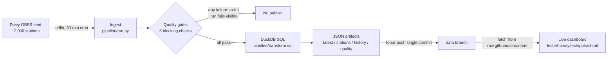

# Chicago Station Pulse

A zero-cost, fully automated data pipeline that ingests Divvy bike-share's live
[GBFS](https://github.com/MobilityData/gbfs) feed every 30 minutes, validates it
against blocking quality gates, transforms it with SQL, and publishes compact
JSON artifacts that power a live dashboard at
**[lesterharvey.tech/pulse.html](https://lesterharvey.tech/pulse.html)**.

Built as the real-time sequel to my
[Cyclistic rider analysis](https://lesterharvey.tech/cyclistic.html) — that
project analyzed 6.2M historical rides; this one engineers a living pipeline on
the same system.

## Architecture



- **Scheduler:** GitHub Actions cron (`.github/workflows/pipeline.yml`) — free,
  versioned, and the run history doubles as a public pipeline log.
- **Ingestion:** stdlib `urllib` against `station_status` + `station_information`.
- **Quality gates** (all blocking — a failed gate fails the run rather than
  publishing bad data): station count in range, feed freshness < 30 min,
  status↔info join coverage ≥ 99%, no negative counts, citywide totals sane.
- **Transform:** DuckDB executes `transform.sql` — an `active` view joining the
  feeds and filtering to installed+renting stations, then citywide KPI and
  top-station aggregations.
- **Storage:** artifacts are force-pushed as a single commit to the `data`
  branch — bounded repo size, no history bloat, served free over
  `raw.githubusercontent.com` with CORS enabled.
- **Rolling window:** each run restores `history.json` from the data branch,
  appends one point, and trims to 7 days x 48 points.

## Artifacts (data branch)

| File | Contents |
|------|----------|
| `latest.json` | Citywide KPIs: stations online, bikes/e-bikes/docks available, % empty/full stations, capacity in use |
| `stations.json` | Top 15 stations by bikes ready to ride, with coordinates |
| `history.json` | Rolling 7-day citywide series (30-minute grain) |
| `quality.json` | Per-check gate results, rows processed, runtime — rendered as the dashboard's pipeline-health panel |

## Design decisions

- **Fail loud, publish nothing:** a bad feed should break the run, not the
  dashboard. Gates exit non-zero; the Actions badge and run log show exactly
  which check failed and what was observed.
- **Bounded everything:** rolling history, top-N stations, single-commit data
  branch. The pipeline can run every 30 minutes for years at zero cost and
  zero growth.
- **SQL where SQL belongs:** joins and aggregations live in `transform.sql`,
  not Python loops — the transform layer is readable by anyone who knows SQL.

## Run it yourself

```bash
pip install duckdb
python pipeline/run.py   # writes out/*.json
```

## Roadmap

- Neighborhood-level aggregation (community-area polygon join)
- BigQuery sink + dbt models once history justifies a real warehouse
- Rebalancing-detection: flag stations that empty/fill unnaturally fast

---
Lester Harvey · [lesterharvey.tech](https://lesterharvey.tech) ·
Data: Divvy/Lyft GBFS, public per the [Divvy data license](https://divvybikes.com/data-license-agreement).
